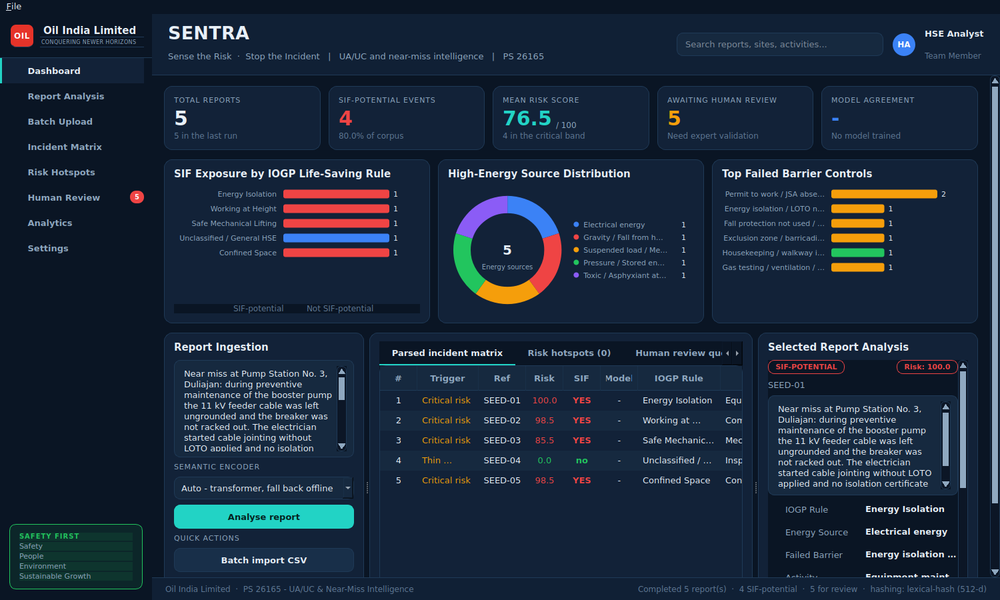

# SIF Insight Console

Prototype for **Oil India Limited — Problem Statement 26165**: turning raw
Unsafe Act / Unsafe Condition (UA/UC) and near-miss reports into structured,
decision-grade **SIF (Serious Injury & Fatality) intelligence**.



Other pages: [Settings — system logging & MLOps](docs/settings-mlops.png) ·
[Analytics](docs/analytics.png) · [Batch upload](docs/batch-upload.png) ·
[Human review queue](docs/review-queue.png).

> **Operating manual:** [INSTRUCTION.md](INSTRUCTION.md) — the rules the system
> must be used under, step-by-step install and daily process, how to train the
> model on reviewed labels, and what has to change before it is trusted on live
> safety data.

## Run it

```bash
pip install -r requirements.txt
python app.py
```

Click **Load 5 Seed Incidents** for an instant demo, or **Batch Import CSV** and
pick `sample_reports.csv`. The first run downloads the sentence-transformer
(~90 MB); the status bar reports progress and the UI stays responsive.

To run with no model and no network, pick **Offline — lexical rules only** in the
encoder selector, or export `SIF_ENCODER=hashing`.

Everything optional is detected at run time. Without `xgboost`/`mlflow` the
console runs on the rule and semantic paths and the Settings tab says so; without
`paddleocr` it still reads PDFs that carry a text layer.

### The pages

| Page | What it is for |
| --- | --- |
| **Dashboard** | KPI tiles, the three exposure charts, ingestion box, incident matrix and the evidence panel for the selected report. |
| **Report Analysis** | The dashboard with the ingestion box focused — paste one narrative, read its verdict and evidence. |
| **Batch Upload** | Drop in PDFs, scans, photographs or CSVs; shows which backend read each file, its OCR confidence and the extracted text. |
| **Incident Matrix / Risk Hotspots / Human Review** | Full-width versions of the three result tables. |
| **Analytics** | Corpus-level charts plus the learned model's summary and feature importances. |
| **Settings** | System logging, MLflow + XGBoost controls, and OCR configuration. |

### Settings — system logging and MLOps

* **System logging** — every component logs through `logging`; the tab shows a
  live, level-filtered view of the ring buffer, names the rotating file under
  `logs/`, and lets you change level or clear the buffer at runtime.
* **MLflow** — set the tracking URI and experiment (default
  `sqlite:///mlflow.db`, since MLflow 3 put the file store into maintenance
  mode). Recent runs are listed with their metrics.
* **XGBoost** — train on the analysed corpus in one click. The run logs params,
  metrics, feature importances and the model artifact to MLflow, saves the
  booster to `models/`, and attaches it to the pipeline as a third opinion.
* **PaddleOCR** — enable/disable OCR, pick a language, and *actually load* the
  engine with "Check OCR availability" (it reports the real outcome, including a
  failed model download, rather than guessing from the import).

## Architecture

```
                    REPORT (text · CSV · PDF · scan · photo)
                             │
                    ┌────────▼────────┐
                    │ DOCUMENT INGEST │  sif/ocr.py
                    │ text · pdf-text │  PaddleOCR for scanned pages
                    │ · paddleocr     │
                    └────────┬────────┘
                             │
                    ┌────────▼────────┐
                    │ NLP PREPROCESSOR│  sif/preprocessing.py
                    └────────┬────────┘  clean · expand LOTO/PTW/GGS · segment
                             │
                  ┌──────────▼───────────┐
                  │ Semantic NLP Engine  │  sif/encoders.py
                  │ Transformer Encoder  │  all-MiniLM-L6-v2 · offline fallback
                  └──────────┬───────────┘
                             │
        ┌────────────────────┼─────────────────────┐
        ▼                    ▼                     ▼
  SIF Classifier      Rule Classifier        NER / Extraction     sif/heads.py
  P(SIF)=energy×      IOGP Life-Saving       ┌──────┼───────┐
  barrier             Rule                   ▼      ▼       ▼
        │                    │           Activity Location Barrier
        └────────────────────┼─────────────────────┘
                             ▼
                    ┌─────────────────┐
                    │ Evidence Engine │  sif/evidence.py
                    └────────┬────────┘  cues · neighbours · decision path
                             ▼
                     ┌───────────────┐
                     │ SIF Risk Score│  sif/scoring.py   0–100 + band
                     └───────┬───────┘
                             │  ◄── XGBoost model as a third opinion
                             │      (sif/mlops.py, tracked in MLflow)
                  ┌──────────┴──────────┐
                  ▼                     ▼
          Pattern Detection        Human Review        sif/patterns.py
          (sif/patterns.py)        (sif/review.py)
                  │                     │
                  ▼                     │
           ┌───────────────┐            │
           │ Risk Hotspots │◄───────────┘
           └───────┬───────┘
                   ▼
            HSE Intelligence          sif/pipeline.py → Intelligence
                   ▼
               Dashboard              main.py (PyQt6)
```

### Stage by stage

| Stage | Module | What it does |
| --- | --- | --- |
| 1. Preprocessor | `sif/preprocessing.py` | Cleans the text, expands upstream shorthand (LOTO, PTW, GGS, H2S…) for the encoder while preserving the reporter's surface wording for the patterns, and segments sentences. |
| 2. Semantic encoder | `sif/encoders.py` | `all-MiniLM-L6-v2` sentence embeddings via `sentence-transformers`, behind a small interface. A deterministic hashing encoder is the offline fallback; resolution is eager, so a missing model degrades before the batch starts, not halfway through. |
| 3a. SIF classifier | `sif/heads.py` | `P(SIF) = energy_score × barrier_score` — the "high energy **AND** failed barrier" rule expressed continuously. Each factor is the max of the lexical determination and the calibrated similarity to the energy / barrier prototypes. |
| 3b. Rule classifier | `sif/heads.py` | Fuses per-rule lexical scores with cosine similarity to the IOGP rule prototypes (0.55/0.45 with a model, 0.8/0.2 without), and returns `Unclassified` below a floor rather than guessing. |
| 3c. NER / extraction | `sif/heads.py` | Activity, location and barrier: gazetteer and pattern hits first, semantic nearest-prototype only where the lexical layer fell back, and an explicit "not stated" below the similarity floor. |
| 4. Evidence engine | `sif/evidence.py` | Collects lexical cues, nearest semantic prototypes with scores, per-field provenance and the decision path, then writes the one-line explanation shown in the UI. |
| 5. Risk score | `sif/scoring.py` | `100 × P(SIF) × energy severity × barrier criticality × evidence factor`, banded Critical / High / Medium / Low. Ordinal, for ranking a queue — not an actuarial probability. |
| 6a. Pattern detection | `sif/patterns.py` | Location clusters, rule-at-location repeats and repeat barrier failures across the corpus (≥2 reports), ranked by SIF count then mean risk. |
| 6b. Human review | `sif/review.py` | Queues what a person must verify: model/rule **disagreement**, **critical risk**, **thin evidence**, or **high energy with no rule match**. |
| 7. Dashboard | `main.py` + `ui/` | Sidebar navigation, KPI tiles, painted charts, the three result tables, evidence panel and Settings. |

### The learned layer (MLOps)

`sif/mlops.py` turns each result into a **named, interpretable feature vector**
(45 columns: the two SIF factors, energy and barrier families as multi-hot flags,
severity weights, the rule one-hot, text statistics) and fits an
`XGBClassifier` with stratified cross-validation. Feature importance therefore
reads as safety language — `p_sif`, `barrier_criticality`, `energy::Electrical
energy` — not as `f37`.

Two things are deliberate and worth knowing:

* **Labels.** With no reviewed corpus, training defaults to the pipeline's own
  verdicts. That is *distillation*: the model learns to reproduce the rules and
  adds no knowledge until real labels replace them, which is what the review
  queue exists to produce. The label source is recorded on every run.
* **Small corpora.** XGBoost's default `min_child_weight` silently forbids any
  split that isolates fewer than ~4 reports, so a pilot corpus yields split-less
  trees and a constant probability — a model that looks trained and predicts
  nothing. `adapt_params` relaxes it for small runs and records a warning on the
  report.

Where the model contradicts the pipeline, the report is queued as a **model
disagreement** — the highest-value row to label, since one of the two is wrong.

### Why fusion, not replacement

The semantic layer **extends** the deterministic rules; it never overturns them.
A report the patterns flag stays flagged, and the model can add a flag the
patterns missed — so recall only grows. Two guards keep that honest:

* the offline fallback is explicitly non-semantic: it can rank and enrich, but it
  never raises a flag of its own, so offline mode is exactly as precise as the
  rules; and
* a **discrimination guard** — if an encoder scores every prototype alike (an
  untrained, mis-loaded or otherwise degenerate model), the ranking is treated as
  uninformative and the decision falls back to the lexical rules.

Every result records which path decided it (`evidence.decision_path`), and any
disagreement between the two goes to the human review queue.

## Module map

| File | Responsibility |
| --- | --- |
| `sif/pipeline.py` | `SIFPipeline` — orchestration, `PipelineResult`, corpus `Intelligence`. |
| `sif/ocr.py` | `DocumentExtractor` — plain text, PDF text layer, PaddleOCR for scans; per-line OCR confidence. |
| `sif/mlops.py` | Features, `SIFModel` (XGBoost), `MLflowTracker`, `MLOpsService`. |
| `sif/logging_setup.py` | Rotating file + in-memory ring buffer behind the Settings log view. |
| `ui/` | `theme` (palette, style sheet, scroll-control assets), `charts` (painted bar/donut), `components`, `views`. |
| `ui/assets/` | Scrollbar stepper arrows - Qt cannot draw a triangle reliably from a style sheet alone. |
| `sif/lexical.py` | `LexicalEngine` — IOGP, energy, barrier, activity and location knowledge as patterns; the deterministic backbone. Holds the 5 seed narratives. |
| `sif/prototypes.py` | Natural-language label descriptions for zero-shot semantic classification. |
| `main.py` | PyQt6 layer: `MainWindow`, `AnalysisWorker` (`QThread`), KPI cards, three panels. |
| `app.py` | Launcher — dependency check, `QApplication` bootstrap, event loop. |
| `train_model.py` | Command-line trainer: analyse a CSV, train on reviewed labels, log the run to MLflow. |
| `test_sif.py` | 72 unit tests across every stage, the fusion guards, MLOps, document extraction and the Qt widgets. |
| `sample_reports.csv` | Six mock rows for the batch-import demo. |
| `reports/` | Generated analysis report (PDF). |

## Result fields

`SIFPipeline.analyze(text)` returns a `PipelineResult`. The five fields the
problem statement asks for keep their names: `sif_potential`, `iogp_rule`,
`activity`, `location`, `barrier_failure`. Alongside them:

`p_sif`, `risk_score`, `risk_band`, `energy_source`, `high_energy`,
`barrier_failed`, `lexical_flag`, `semantic_flag`, `semantic_active`,
`rule_confidence`, `confidence`, `severity_hint`, `needs_review`,
`review_trigger`, `review_reason`, `explanation`, `evidence`, `encoder`,
`elapsed_ms`, and — when a model is attached — `ml_probability`, `ml_flag`,
`ml_active`.

Every extractor degrades to an explicit fallback (`Unclassified / General HSE`,
`Unspecified activity`, `Location not stated`, `No barrier failure identified`)
rather than raising, so a malformed row never breaks a batch.

## Scrolling

Every page that can outgrow the window scrolls rather than compressing: the
dashboard, batch upload, analytics and settings pages each sit in a scroll area
with a minimum content height, the sidebar nav scrolls on short screens, and all
tables scroll per pixel in both directions.

The controls themselves are styled to match the rest of the console - a sunken
track, a light rounded thumb, and stepper arrows at both ends drawn from the PNGs
in `ui/assets/`, since a Qt style sheet cannot reliably draw the triangles
itself. A unit test asserts every asset the style sheet references exists, so a
rename cannot silently leave the arrows blank.

## Concurrency

Four worker threads, no blocking work on the GUI thread:

| Worker | Runs |
| --- | --- |
| `AnalysisWorker` | Encoder load and every pipeline stage; streams one row at a time. |
| `ExtractionWorker` | PDF reading and OCR, including PaddleOCR's first-run model download. |
| `TrainingWorker` | XGBoost training and the MLflow run. |
| `OCRProbeWorker` | The "Check OCR availability" probe. |

Results come back over `pyqtSignal` — `row_ready(dict)`, `progress(int, int)`,
`status(str)`, `failed(str)`, `completed(int)` — so the event loop is never
blocked, including during a model download. A running worker is interrupted
cleanly on window close.

## Tests

```bash
python -m unittest -v
```

On a headless machine prefix with `QT_QPA_PLATFORM=offscreen`. The suite pins the
offline encoder, so it needs no model download and is deterministic; 72 tests
cover every stage, the fusion guards, the MLOps round-trip, document extraction
and the Qt widgets.
