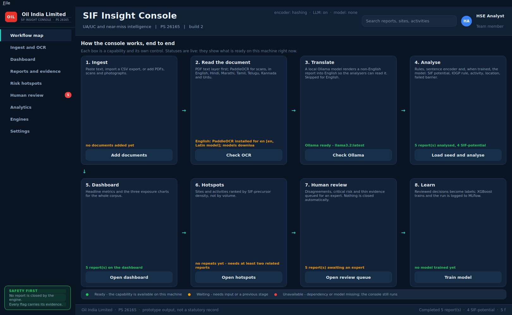
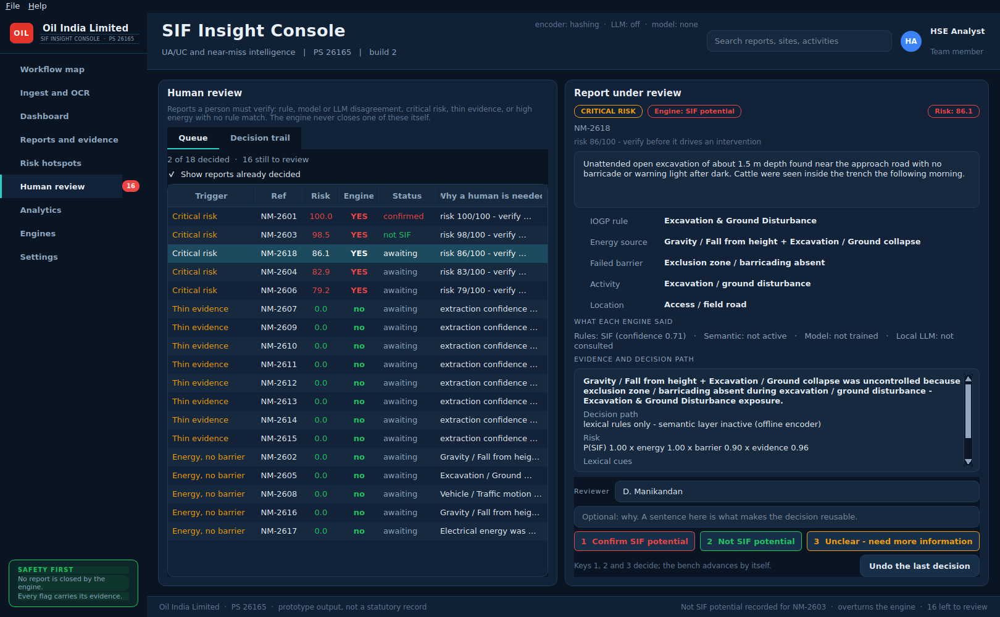

# SENTRA

*Sense the Risk · Stop the Incident*

> Workers report near-misses every day. SENTRA reads each report the moment it is
> written, finds the ones that could have killed someone, shows why, and asks a
> person to confirm.

Prototype for **Oil India Limited — Problem Statement 26165**: turning raw
Unsafe Act / Unsafe Condition (UA/UC) and near-miss reports into structured,
decision-grade **SIF (Serious Injury & Fatality) intelligence**.
The engine is SENTRA; `sif/` remains the package name, and the settings folder
keeps its old name so an existing operator's review decisions are not orphaned.


Other pages: [Settings — system logging & MLOps](docs/settings-mlops.png) ·
[Analytics](docs/analytics.png) · [Batch upload](docs/batch-upload.png) ·
[Human review queue](docs/review-queue.png).

> **Operating manual:** [INSTRUCTION.md](INSTRUCTION.md) — the rules the system
> must be used under, step-by-step install and daily process, how to train the
> model on reviewed labels, and what has to change before it is trusted on live
> safety data.

## Run it

```bash
pip install -r requirements.txt
python app.py       # build 1 - the original console
python app2.py      # build 2 - workflow map, Indian-language OCR, local LLM
```

### Two builds

`app.py` is unchanged. `app2.py` is a second front end over the same analysis
stack, adding four things:

| Addition | What it means |
| --- | --- |
| **Workflow map** | The first page maps every capability - ingest, OCR, translate, analyse, dashboard, hotspots, review, learn - with a live status on each and its own control.  |
| **Review bench** | The queue on the left, the whole case on the right, and three keys to decide it. Decisions persist as they are made, keep an audit trail, and become the labels the model trains on.  |
| **Indian-language ingestion** | PaddleOCR in Hindi, Marathi, Tamil, Telugu, Kannada, Urdu, Nepali, Sanskrit, Bhojpuri, Maithili and Konkani. Non-English reports are translated to English before analysis, and the original is kept as the audit record. |
| **Local LLM analyser (Ollama)** | Optional fourth opinion, running on the operator's own machine. It never overrides the pipeline; where it disagrees, the report is queued for a human. |
| **Separate dashboard, no pictographs** | Metrics and charts live on their own page, away from ingestion and the matrix, and the interface uses no emoji, so it renders identically on a workstation with no emoji font. |

Ollama is optional and not bundled: install it from ollama.com, then
`ollama pull llama3.2`. Without it, build 2 runs exactly as build 1 does and the
workflow map says which stage is unavailable and why.

Click **Load 5 Seed Incidents** for an instant demo, or **Batch Import CSV** and
pick `sample_reports.csv`. The first run downloads the sentence-transformer
(~90 MB); the status bar reports progress and the UI stays responsive.

To run with no model and no network, pick **Offline — lexical rules only** in the
encoder selector, or export `SIF_ENCODER=hashing`.

Everything optional is detected at run time. Without `xgboost`/`mlflow` the
console runs on the rule and semantic paths and the Settings tab says so; without
`paddleocr` it still reads PDFs that carry a text layer.

### The pages

| Page | What it is for |
| --- | --- |
| **Dashboard** | KPI tiles, the three exposure charts, ingestion box, incident matrix and the evidence panel for the selected report. |
| **Report Analysis** | The dashboard with the ingestion box focused — paste one narrative, read its verdict and evidence. |
| **Batch Upload** | Drop in PDFs, scans, photographs or CSVs; shows which backend read each file, its OCR confidence and the extracted text. |
| **Incident Matrix / Risk Hotspots / Human Review** | Full-width versions of the three result tables. |
| **Analytics** | Corpus-level charts plus the learned model's summary and feature importances. |
| **Settings** | System logging, MLflow + XGBoost controls, and OCR configuration. |

### Settings — system logging and MLOps

* **System logging** — every component logs through `logging`; the tab shows a
  live, level-filtered view of the ring buffer, names the rotating file under
  `logs/`, and lets you change level or clear the buffer at runtime.
* **MLflow** — set the tracking URI and experiment (default
  `sqlite:///mlflow.db`, since MLflow 3 put the file store into maintenance
  mode). Recent runs are listed with their metrics.
* **XGBoost** — train on the analysed corpus in one click. The run logs params,
  metrics, feature importances and the model artifact to MLflow, saves the
  booster to `models/`, and attaches it to the pipeline as a third opinion.
* **PaddleOCR** — enable/disable OCR, pick a language, and *actually load* the
  engine with "Download / verify OCR models" (it reports the real outcome,
  including a failed model download, rather than guessing from the import). The
  models are fetched **once per machine** and kept in `~/.paddlex`; the console
  reads that directory, so a machine that already has them is told so at every
  start-up rather than asked to check again. `python -m sif.ocr en hi ta` does
  the download deliberately, and `--list` shows what is already there.

## Architecture

```
                    REPORT (text · CSV · PDF · scan · photo)
                             │
                    ┌────────▼────────┐
                    │ DOCUMENT INGEST │  sif/ocr.py
                    │ text · pdf-text │  PaddleOCR for scanned pages
                    │ · paddleocr     │
                    └────────┬────────┘
                             │
                    ┌────────▼────────┐
                    │ NLP PREPROCESSOR│  sif/preprocessing.py
                    └────────┬────────┘  clean · expand LOTO/PTW/GGS · segment
                             │
                  ┌──────────▼───────────┐
                  │ Semantic NLP Engine  │  sif/encoders.py
                  │ Transformer Encoder  │  all-MiniLM-L6-v2 · offline fallback
                  └──────────┬───────────┘
                             │
        ┌────────────────────┼─────────────────────┐
        ▼                    ▼                     ▼
  SIF Classifier      Rule Classifier        NER / Extraction     sif/heads.py
  P(SIF)=energy×      IOGP Life-Saving       ┌──────┼───────┐
  barrier             Rule                   ▼      ▼       ▼
        │                    │           Activity Location Barrier
        └────────────────────┼─────────────────────┘
                             ▼
                    ┌─────────────────┐
                    │ Evidence Engine │  sif/evidence.py
                    └────────┬────────┘  cues · neighbours · decision path
                             ▼
                     ┌───────────────┐
                     │ SIF Risk Score│  sif/scoring.py   0–100 + band
                     └───────┬───────┘
                             │  ◄── XGBoost model as a third opinion
                             │      (sif/mlops.py, tracked in MLflow)
                  ┌──────────┴──────────┐
                  ▼                     ▼
          Pattern Detection        Human Review        sif/patterns.py
          (sif/patterns.py)        (sif/review.py)
                  │                     │
                  ▼                     │
           ┌───────────────┐            │
           │ Risk Hotspots │◄───────────┘
           └───────┬───────┘
                   ▼
            HSE Intelligence          sif/pipeline.py → Intelligence
                   ▼
               Dashboard              main.py (PyQt6)
```

### Stage by stage

| Stage | Module | What it does |
| --- | --- | --- |
| 1. Preprocessor | `sif/preprocessing.py` | Cleans the text, expands upstream shorthand (LOTO, PTW, GGS, H2S…) for the encoder while preserving the reporter's surface wording for the patterns, and segments sentences. |
| 2. Semantic encoder | `sif/encoders.py` | `all-MiniLM-L6-v2` sentence embeddings via `sentence-transformers`, behind a small interface. A deterministic hashing encoder is the offline fallback; resolution is eager, so a missing model degrades before the batch starts, not halfway through. |
| 3a. SIF classifier | `sif/heads.py` | `P(SIF) = energy_score × barrier_score` — the "high energy **AND** failed barrier" rule expressed continuously. Each factor is the max of the lexical determination and the calibrated similarity to the energy / barrier prototypes. |
| 3b. Rule classifier | `sif/heads.py` | Fuses per-rule lexical scores with cosine similarity to the IOGP rule prototypes (0.55/0.45 with a model, 0.8/0.2 without), and returns `Unclassified` below a floor rather than guessing. |
| 3c. NER / extraction | `sif/heads.py` | Activity, location and barrier: gazetteer and pattern hits first, semantic nearest-prototype only where the lexical layer fell back, and an explicit "not stated" below the similarity floor. |
| 4. Evidence engine | `sif/evidence.py` | Collects lexical cues, nearest semantic prototypes with scores, per-field provenance and the decision path, then writes the one-line explanation shown in the UI. |
| 5. Risk score | `sif/scoring.py` | `100 × P(SIF) × energy severity × barrier criticality × evidence factor`, banded Critical / High / Medium / Low. Ordinal, for ranking a queue — not an actuarial probability. |
| 6a. Pattern detection | `sif/patterns.py` | Location, activity, rule-at-location and repeat-barrier clusters (≥2 reports), ranked by **SIF-precursor density** — the share of a group's reports carrying fatal potential — discounted by a Wilson lower bound so a 2-of-2 group cannot outrank a well-evidenced one. |
| 6b. Human review | `sif/review.py` | Queues what a person must verify: model/rule **disagreement**, **critical risk**, **thin evidence**, **high energy with no rule match**, or **energy with no barrier found**. Records the expert's decision, persists it, and hands it back as the labels training uses. |
| 7. Dashboard | `main.py` + `ui/` | Sidebar navigation, KPI tiles, painted charts, the three result tables, evidence panel and Settings. |

### The learned layer (MLOps)

`sif/mlops.py` turns each result into a **named, interpretable feature vector**
(45 columns: the two SIF factors, energy and barrier families as multi-hot flags,
severity weights, the rule one-hot, text statistics) and fits an
`XGBClassifier` with stratified cross-validation. Feature importance therefore
reads as safety language — `p_sif`, `barrier_criticality`, `energy::Electrical
energy` — not as `f37`.

Two things are deliberate and worth knowing:

* **Labels.** With no reviewed corpus, training defaults to the pipeline's own
  verdicts. That is *distillation*: the model learns to reproduce the rules and
  adds no knowledge until real labels replace them, which is what the review
  queue exists to produce. The label source is recorded on every run.
* **Small corpora.** XGBoost's default `min_child_weight` silently forbids any
  split that isolates fewer than ~4 reports, so a pilot corpus yields split-less
  trees and a constant probability — a model that looks trained and predicts
  nothing. `adapt_params` relaxes it for small runs and records a warning on the
  report.

Where the model contradicts the pipeline, the report is queued as a **model
disagreement** — the highest-value row to label, since one of the two is wrong.

### Why fusion, not replacement

The semantic layer **extends** the deterministic rules; it never overturns them.
A report the patterns flag stays flagged, and the model can add a flag the
patterns missed — so recall only grows. Two guards keep that honest:

* the offline fallback is explicitly non-semantic: it can rank and enrich, but it
  never raises a flag of its own, so offline mode is exactly as precise as the
  rules; and
* a **discrimination guard** — if an encoder scores every prototype alike (an
  untrained, mis-loaded or otherwise degenerate model), the ranking is treated as
  uninformative and the decision falls back to the lexical rules.

Every result records which path decided it (`evidence.decision_path`), and any
disagreement between the two goes to the human review queue.

## Releases and updates

Pushing a version tag builds installers for Windows, macOS and Linux and
publishes a GitHub Release; the app checks for it and offers the update. See
[RELEASING.md](RELEASING.md).

```bash
git tag -a v2.1.0 -m "..." && git push origin v2.1.0
```

## Module map

| File | Responsibility |
| --- | --- |
| `sif/pipeline.py` | `SIFPipeline` — orchestration, `PipelineResult`, corpus `Intelligence`. |
| `sif/ocr.py` | `DocumentExtractor` — plain text, PDF text layer, PaddleOCR for scans; per-line OCR confidence. Also the model cache: one engine per language for the life of the process, a disk check so a downloaded model is never re-announced as pending, and `python -m sif.ocr` to fetch them once. |
| `sif/mlops.py` | Features, `SIFModel` (XGBoost), `MLflowTracker`, `MLOpsService`. |
| `sif/logging_setup.py` | Rotating file + in-memory ring buffer behind the Settings log view. |
| `sif/audit.py` | The audit trail: append-only JSONL, `system` and `functionality` entries, CSV export. Separate from the log, because the log rotates away. |
| `ui/` | `theme` (palette, style sheet, scroll-control assets), `charts` (painted bar/donut), `components`, `views`. |
| `ui/assets/` | Scrollbar stepper arrows - Qt cannot draw a triangle reliably from a style sheet alone. |
| `sif/lexical.py` | `LexicalEngine` — IOGP, energy, barrier, activity and location knowledge as patterns; the deterministic backbone. Holds the 5 seed narratives. |
| `sif/prototypes.py` | Natural-language label descriptions for zero-shot semantic classification. |
| `main.py` | PyQt6 layer: `MainWindow`, `AnalysisWorker` (`QThread`), KPI cards, three panels. |
| `app.py` | Launcher — dependency check, `QApplication` bootstrap, event loop. |
| `train_model.py` | Command-line trainer: analyse a CSV, train on reviewed labels, log the run to MLflow. |
| `sif/updater.py` | Checks GitHub Releases, verifies the download's checksum, launches the installer. |
| `sif/version.py` | The one place the version lives; CI stamps it from the git tag. |
| `packaging/`, `.github/workflows/release.yml` | PyInstaller spec, Inno Setup script, tag-driven release pipeline. |
| `test_sif.py` | 74 unit tests across every stage, the fusion guards, MLOps, document extraction and the Qt widgets. |
| `test_app2.py` | 67 tests for build 2: language handling, the local LLM, the workflow map, the review bench, the decision log and the OCR model cache. |
| `test_release.py` | 23 tests for versioning, the update checker and the release pipeline. |
| `test_functional.py` | 20 end-to-end tests: both windows driven against the real `samples/` files, from import through review to a trained model. |
| `sample_reports.csv` | Six mock rows for the batch-import demo. |
| `samples/` | Test material for every ingestion path - an 18-report CSV, a shift log, a text-layer PDF, a scan with no text layer, and reports in five Indian languages. See `samples/README.md`. |
| `reports/` | Generated analysis report (PDF). |

## Result fields

`SIFPipeline.analyze(text)` returns a `PipelineResult`. The five fields the
problem statement asks for keep their names: `sif_potential`, `iogp_rule`,
`activity`, `location`, `barrier_failure`. Alongside them:

`p_sif`, `risk_score`, `risk_band`, `energy_source`, `high_energy`,
`barrier_failed`, `lexical_flag`, `semantic_flag`, `semantic_active`,
`rule_confidence`, `confidence`, `severity_hint`, `needs_review`,
`review_trigger`, `review_reason`, `explanation`, `evidence`, `encoder`,
`elapsed_ms`, and — when a model is attached — `ml_probability`, `ml_flag`,
`ml_active`.

Every extractor degrades to an explicit fallback (`Unclassified / General HSE`,
`Unspecified activity`, `Location not stated`, `No barrier failure identified`)
rather than raising, so a malformed row never breaks a batch.

## How good is the engine?

A number, not an adjective. `evaluation/` holds 40 hand-labelled reports and a
scorer:

```bash
python evaluation/evaluate.py            # the offline rule engine
python evaluation/evaluate.py --errors   # every miss, with its text
```

| Metric | Before the barrier work | Now |
| --- | --- | --- |
| **Recall** (of 24 real precursors) | 0.292 | **1.000** |
| **Precision** (16 negative controls) | 1.000 | **1.000** |
| Barrier recall | 0.292 | **1.000** |
| Energy recall | 0.917 | **1.000** |
| Rule accuracy (on true positives) | 0.792 | **0.958** |

Recall was the problem, and the cause was specific: `P(SIF) = energy x barrier`,
so a barrier the vocabulary could not name scored zero however obvious the
hazard. The engine was reading explicit negatives ("no LOTO was applied") and
missing implicit ones - "clipped to the handrail **instead of** the anchor
point", "car-sealed open with no tag", "no test for dead", "the trip tank had not
been monitored". Those are now in the knowledge base.

**Read those numbers honestly.** The labelled set is 40 cases written for this
repository, and the vocabulary was extended after seeing which of them missed -
that is fitting to the test. Two things make it more than that:

* **16 negative controls.** Every positive case has a twin describing the same
  incident with the barrier *holding* ("LOTO was applied and verified", "the
  exclusion zone was barricaded and the banksman kept the area clear"). Chasing
  recall by loosening patterns fails those immediately, and they include two
  counterfactual traps using the exact "would have been struck" phrasing that the
  near-miss pattern looks for.
* **A held-out corpus.** The 18 reports in `samples/near_miss_reports.csv` were
  written before this work and were not tuned against. Flags there went from 5 to
  13, and the five that still do not flag are the five low-consequence ones.

The real number comes from OIL's own reports, and the review queue is what
produces it: `test_sif.py::TestEngineQuality` holds the floor at 0.90 recall and
0.90 precision so a future change cannot quietly undo this.

## Review happens in English

A reviewer confirms or overturns a fatal-potential call. They cannot do that on
words they do not read, so wherever a report is put to a person - the review
bench and the report detail - the **English rendering is what is shown**, and the
bar above it says which text is on screen:

| The report | What the bench shows | What the bar says |
| --- | --- | --- |
| Translated from Tamil | The English | `ENGLISH - TRANSLATED FROM TAMIL FOR REVIEW`, with **Show the original** beside it |
| Not in English, not translated | The original, because there is nothing else | `NOT TRANSLATED - ... START OLLAMA AND RE-ANALYSE BEFORE DECIDING` in red |
| Written in English | The report | `ENGLISH AS WRITTEN` |

The original is never hidden and never replaced: it is one button away on the
bench, it sits under EVIDENCE AND REASONING on the report page, and it is what
the decision log and the audit trail keep. The translation is for reading; the
original is the record.

## The audit trail

Settings carries two records, and they are not the same thing.

* **System logging** is diagnostics. Verbose, full of third-party chatter, and it
  rotates away after a few megabytes - right for finding out why something failed
  this morning, wrong for anything else.
* **The audit trail** (`sif/audit.py`) is append-only JSONL beside the settings
  file, one line per event, and nothing rotates it. **SYSTEM** entries are what
  the software did by itself - started, attached a model, fetched OCR models,
  checked for a release. **FUNCTIONALITY** entries are what an operator asked for
  and what came back - reports analysed (with how many were repeats), documents
  read, a model trained and on whose labels, every review decision, every export.

Every entry carries the operating-system user, the reviewer name when one is set,
the version, and its own detail. Filter by kind, and export to CSV for an
auditor. If the location cannot be written the trail says **MEMORY ONLY** rather
than letting anyone believe it reached disk.

## Scrolling

Every page that can outgrow the window scrolls rather than compressing. Each
sits in a scroll area with a minimum content height below which the bar appears
instead of the content shrinking; the sidebar nav scrolls on short screens; and
all tables scroll per pixel in both directions. Verified at **1280 x 720** - a
plant laptop, not a desk monitor - with every page reachable:

| Build 2 page | How it scrolls |
| --- | --- |
| Workflow map | The eight stage cards and the legend, below 720 px |
| Ingest and OCR, Dashboard, Engines, Settings | Whole page, below their own floors |
| Reports and evidence | Matrix scrolls itself; the detail column has its own area |
| Risk hotspots | The table, in both directions |
| Human review | Queue table scrolls; the case detail scrolls; **the three decision buttons never do** - they stay pinned where the reviewer's eye expects them |
| Analytics | Whole page, below 900 px |

The scrollbars themselves - track, thumb and the stepper arrows from
`ui/assets/` - are styled once, globally, so anything wrapped in a scroll area
picks them up without asking.

The controls themselves are styled to match the rest of the console - a sunken
track, a light rounded thumb, and stepper arrows at both ends drawn from the PNGs
in `ui/assets/`, since a Qt style sheet cannot reliably draw the triangles
itself. A unit test asserts every asset the style sheet references exists, so a
rename cannot silently leave the arrows blank.

## Concurrency

Four worker threads, no blocking work on the GUI thread:

| Worker | Runs |
| --- | --- |
| `AnalysisWorker` | Encoder load and every pipeline stage; streams one row at a time. |
| `ExtractionWorker` | PDF reading and OCR, including PaddleOCR's first-run model download. |
| `TrainingWorker` | XGBoost training and the MLflow run. |
| `OCRProbeWorker` | The "Check OCR availability" probe. |

Results come back over `pyqtSignal` — `row_ready(dict)`, `progress(int, int)`,
`status(str)`, `failed(str)`, `completed(int)` — so the event loop is never
blocked, including during a model download. A running worker is interrupted
cleanly on window close.

## Tests

```bash
python -m unittest -v
```

On a headless machine prefix with `QT_QPA_PLATFORM=offscreen`. The suite pins the
offline encoder, so it needs no model download and is deterministic; 72 tests
cover every stage, the fusion guards, the MLOps round-trip, document extraction
and the Qt widgets.
